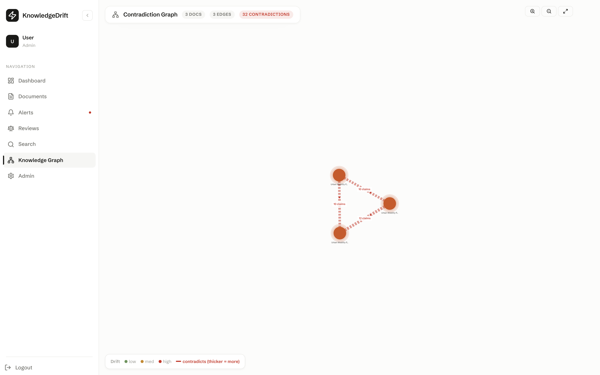
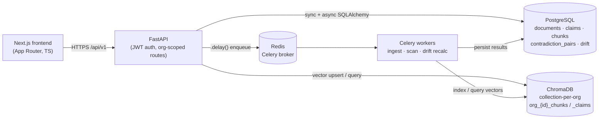
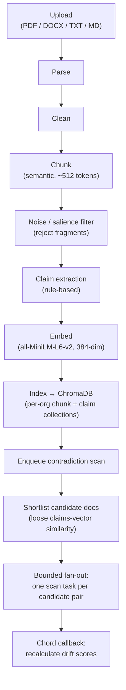
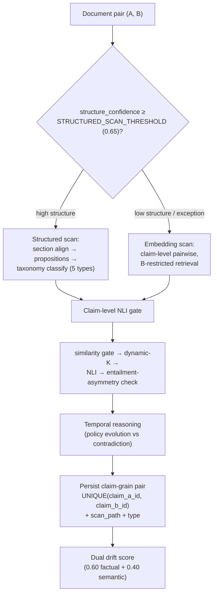

# KnowledgeDrift

KnowledgeDrift is an enterprise knowledge-consistency system that detects **factual and
semantic drift** across a document repository — the contradictory facts and outdated guidelines
that accumulate silently as an organization's documentation grows. It extracts claims from each
document, runs claim-level natural-language inference to find contradictions between documents,
scores per-document drift, and renders the result as an interactive document-contradiction graph.

> Copy-pasteable API examples live in [`docs/API_EXAMPLES.md`](./docs/API_EXAMPLES.md).

## Demo

- **Live frontend:** (https://knowledgedrift.vercel.app/)



The document-contradiction graph from the seeded demo: three transit-policy documents (nodes
colored/sized by drift) with a complete triangle of contradiction edges (thickness scaled by the
number of contradicting claim pairs — 10 / 10 / 12). A working system on first launch (see
[Quickstart](#quickstart)).

## Architecture

Five backend services plus a Next.js frontend. The browser talks to FastAPI over HTTP; document
processing and contradiction scanning run asynchronously on Celery workers behind a Redis broker,
with results persisted to PostgreSQL and vectors to ChromaDB.



**Request path** (synchronous): the frontend calls org-scoped REST endpoints under
`/api/v1`; uploads validate type/size, dedupe by content hash, persist a `Document`, and enqueue
a Celery task. **Async task path:** workers ingest the document, index vectors, run the routed
contradiction scan against a candidate shortlist, persist contradiction pairs at claim
granularity, and recalculate drift scores.

### Document ingestion pipeline

Seven stages, then an auto-dispatched contradiction scan. LLM claim extraction is disabled
(CPU-only environment), so extraction is rule-based.



### Contradiction detection flow

A router picks a scan path per document pair based on structural confidence. Pure embedding
retrieval finds *similar* text, not *opposing* text — so the structured path aligns sections and
extracts propositions before classifying, and both paths converge on claim-level NLI for the
final polarity decision.



## Key engineering

**Contradiction detection pipeline.** Each candidate claim pair flows through retrieval → a
cosine-similarity gate → claim-level NLI (`cross-encoder/nli-deberta-v3-small`) → a bidirectional
entailment-asymmetry check → temporal reasoning. The similarity gate cheaply discards unrelated
pairs; NLI is the precision gate; the asymmetry check distinguishes contradiction from
one-directional elaboration (it roughly doubles NLI calls per pair, gated behind a flag).

**Why section alignment + propositions, not pure retrieval.** Dense embeddings encode
*similarity*, not *polarity*: "fares will rise to $5" and "fares will fall to $1" sit close in
embedding space because they share almost all their tokens and topic. A retrieval-only system
ranks them as near-duplicates and never flags the opposition. KnowledgeDrift therefore routes
structured documents through section alignment and rule-based proposition extraction so opposing
claims about the *same parameter* are compared head-to-head, and uses NLI — not cosine distance —
as the contradiction decision. Embedding similarity is used only to *shortlist* candidates, where
over-inclusion is cheap; the loose shortlist threshold (0.30) reflects this deliberately.

**Claim-grain storage.** Contradictions are keyed and deduped at claim granularity
(`UNIQUE(claim_a_id, claim_b_id)`, canonical ordering), not chunk granularity. Documents chunk
into a few large chunks, so a chunk-level key collapsed many distinct claim contradictions into
one row and understated drift; claim-grain keying preserves each one.

**Collection-per-org multi-tenancy.** Each organization gets its own ChromaDB collections
(`org_{id}_chunks`, `org_{id}_claims`) rather than metadata filtering on a shared collection — a
hard isolation boundary in the vector store, mirrored by `org_id` scoping on every relational
query.

**Auth and tested cross-org isolation.** Self-contained JWT auth (bcrypt via passlib, 24-hour
access token, `SECRET_KEY` from the environment with a validator that refuses the insecure
default when `DEBUG=False`). Three roles — ADMIN / MEMBER / VIEWER (read-only). Every data route
is scoped to the caller's `org_id`: a cross-org read or write returns **404** (no existence
leak), a role violation returns **403**. This is enforced by an integration test,
[`backend/tests/test_cross_org_isolation.py`](./backend/tests/test_cross_org_isolation.py),
which builds two distinct tenants with separate IDs and JWTs and asserts isolation in both
directions plus role enforcement (VIEWER blocked from mutations, non-admin blocked from admin
endpoints).

## Quickstart

Verified clone-and-run — no manual schema or fixture steps:

```bash
# 1. Configure environment (the real .env is gitignored — never commit it)
cp backend/.env.example backend/.env
#    then set a real SECRET_KEY in backend/.env:  openssl rand -hex 32

# 2. Bring up the stack (frontend, backend, celery worker, postgres, redis)
docker compose up -d

# 3. Seed the demo org + Urban Mobility documents through the real pipeline
docker compose exec backend python scripts/seed.py
```

- Frontend: **http://localhost:3000**
- API docs (Swagger): **http://localhost:8000/docs**

The seed runs everything through the actual HTTP + Celery pipeline (upload → ingest → index →
routed scan → drift recalc) and is idempotent (content-hash dedup + claim-grain unique index).
On a fresh database it produces:

| What the seed creates | Value |
|---|---|
| Demo organization | `KnowledgeDrift Demo` |
| Demo admin (login) | `admin@knowledgedrift.dev` / `demo-Admin-123` (role: **ADMIN**) |
| Documents | **3** mutually-contradictory transit-policy docs |
| Contradictions | **~32** claim-grain cross-document pairs |
| Graph | **3 nodes, 3 edges** (complete triangle) |
| Drift scores | **≈ 67** on all three (factual ≈ 98 / semantic ≈ 20) |

The three documents state the same fourteen policy parameters with deliberately far-apart values,
so every cross-document pair on a shared parameter is a genuine contradiction — a constructed
demonstration set with ground truth known by construction, not a held-out benchmark.

## Deploying the frontend to Vercel (demo mode)

The frontend can be deployed standalone — no backend — using a bundled snapshot of the seeded
demo org. When `NEXT_PUBLIC_DEMO_MODE=true`, the API client serves fixtures
(`frontend/src/lib/demoData.ts`) instead of calling the backend, so every page is interactive
and any credentials sign in.

In the Vercel project settings:

- **Root Directory:** `frontend`
- **Environment variable:** `NEXT_PUBLIC_DEMO_MODE=true`
- Framework preset (Next.js) and build/output settings are auto-detected.

Leave `NEXT_PUBLIC_DEMO_MODE` unset for normal local development against the real backend
(`NEXT_PUBLIC_API_URL`, default `http://localhost:8000/api/v1`). To point a deployment at a real
hosted backend instead of demo mode, set `NEXT_PUBLIC_API_URL` to its URL and lock the backend's
`FRONTEND_ORIGIN` to the Vercel domain.

## Running the tests

```bash
docker compose exec backend sh -c "PYTHONPATH=/app pytest tests/ -v"
```

**156 tests passing** — unit and integration, including the cross-org isolation suite.

## Evaluation

Component-level benchmarks live in `backend/evaluation/` and run against a curated 50-pair
labeled dataset (`evaluation/datasets/benchmark_v1.json`):

```bash
docker compose exec backend python -m evaluation.run_all
```

These measure the **NLI model and embedding retrieval in isolation** (they do not exercise the
live multi-document pipeline — vector store, routed scanner, or storage). Current results,
reproducible with the command above:

| Metric | Value | How it's measured |
|---|---|---|
| NLI contradiction precision | **0.86** | Contradiction class on 50 labeled pairs (24 TP / 4 FP). A *true positive* = model labels a contradiction pair "contradiction". |
| NLI contradiction recall | **0.67** | Same set (12 FN) — reported alongside precision; the model misses about a third of contradictions. |
| NLI contradiction F1 | **0.75** | Harmonic mean of the two above. |
| Multiclass accuracy | **0.62** | Across all four classes (contradiction / entailment / neutral / evolution), 50 pairs. |
| Retrieval Recall@1 / Recall@3 | **0.86 / 1.00** | Does cosine similarity rank the true partner in the top-K, over 36 relevant pairs. |
| Retrieval MRR | **0.92** | Mean reciprocal rank of the true partner. |
| Embed + NLI latency | **~70–150 ms/pair** | CPU-only, end-to-end on the 50 pairs; varies with machine load. |

**Read these honestly.** The dataset is small and curated, not a held-out production benchmark;
precision (0.86) is meaningfully higher than recall (0.67), so the system is tuned to avoid false
alarms at the cost of missing some contradictions. The headline capability the architecture buys
— detecting polarity-opposition contradictions that pure embedding retrieval misses — is a design
property, not a single number. Full per-class breakdowns and confusion matrices are written to
`backend/evaluation/results/`.

## Tech stack

- **Backend:** FastAPI · SQLAlchemy (async) · Celery (Redis broker, PostgreSQL result backend)
- **Stores:** PostgreSQL · ChromaDB (collection-per-org)
- **ML:** `all-MiniLM-L6-v2` embeddings (384-dim) · `cross-encoder/nli-deberta-v3-small` NLI (CPU)
- **Frontend:** Next.js (App Router) · React · TypeScript
- **Auth / hardening:** JWT (python-jose) · bcrypt (passlib) · per-IP rate limiting (`limits`)
- **Migrations:** Alembic

## Database migrations

Alembic is the source of truth for clone-and-run reproducibility — a fresh database reaches the
current schema in one command:

```bash
docker compose exec backend sh -c "cd /app && alembic upgrade head"
```

(The app also calls `create_all` on startup, so a plain `docker compose up` works for local
development.)

## Known limitations & design tradeoffs

- **Contradiction scan can miss a pair under concurrent/bulk upload.** Detection is incremental:
  each new document is scanned against existing ones via a candidate shortlist built from the
  *claims* vector collection. Under *rapid or concurrent* uploads, a document's shortlist can run
  before a sibling's claims finish indexing, so that pair is silently skipped (missing graph edge,
  understated drift). It does **not** affect normal one-at-a-time uploads, where human-scale gaps
  let indexing finish. The seed script sidesteps it deterministically with an in-process full-mesh
  coverage pass (idempotent thanks to the claim-grain unique index), so the demo always shows the
  complete graph. The proper fix — a `scanned_pairs` ledger plus a reconciliation task that scans
  any live pair lacking a scan record — is deferred as net-new schema/migration/tests beyond this
  pass. This is an understood, bounded tradeoff, documented rather than papered over.
- **Schema drift between the ORM models and the legacy hand-written migrations.** The Alembic
  baseline is generated from the models (the chosen source of truth). The previously hand-migrated
  database has a few benign differences — DB-level column defaults the models express
  application-side, one index name, one leftover index — surfaced and documented rather than
  force-reconciled.
- **LLM claim extraction is disabled** (CPU-only environment), so claim extraction is rule-based
  and contradiction subtyping is best-effort (always classified by `scan_path`; finer
  `contradiction_type` only when the rule-based taxonomy classifier is confident).

## Secrets

All secrets come from the environment. `backend/.env.example` documents every variable with
placeholder values; the real `backend/.env` is gitignored. `SECRET_KEY` must be a real value (not
the placeholder) whenever `DEBUG=False` — a config validator enforces this at startup.
